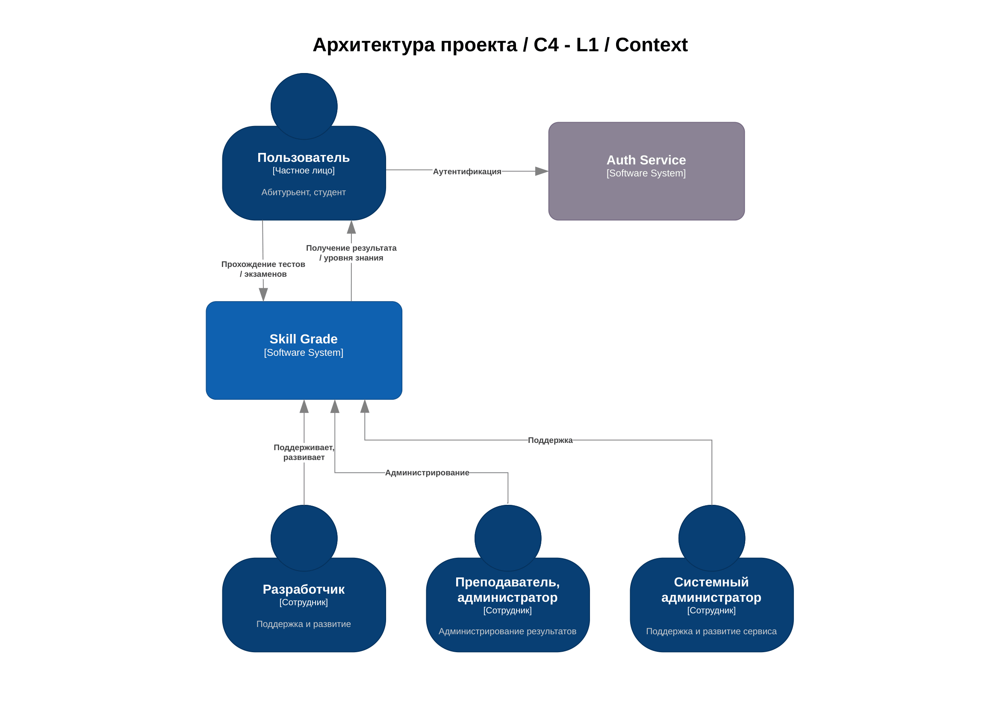
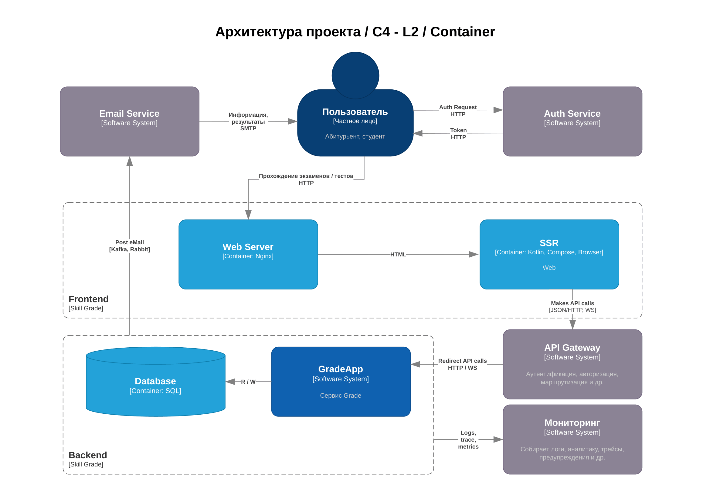
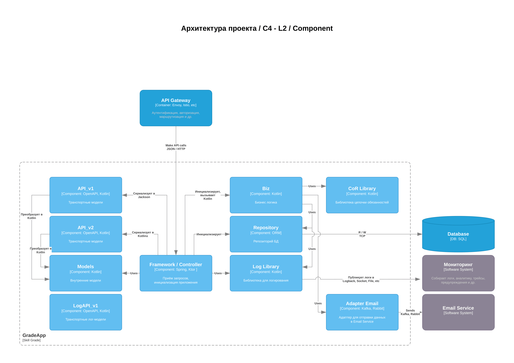

# 📊 Skill Grader — автоматический расчёт уровня знаний студентов

**Skill Grader** — это микросервис для образовательных платформ, который автоматически определяет уровень знаний студента (A1, A2, B1, B2, C1) на основе его результатов тестов.  
Сервис учитывает не просто средний балл, а **комбинацию навыков** (грамматика, лексика, аудирование) и **временное окно** (например, результаты за последние 7 дней), что позволяет объективно отслеживать прогресс.

---

## Целевая аудитория

### 1. Онлайн-школы иностранных языков
**Портрет:**  
Менеджер образовательной платформы с 500+ активными студентами. Устал вручную просматривать результаты тестов и принимать решения о переводе на следующий уровень.  

**Боль:**
- Студенты жалуются на несправедливый перевод.
- Преподаватели тратят часы на анализ успеваемости.

### 2. Корпоративные университеты
**Портрет:**  
L&D-директор в компании с внутренним обучением. Нужно быстро оценить уровень сотрудников перед назначением на проект.  

**Боль:**
- Разрозненные данные из разных систем.
- Нет единого стандарта оценки.

### 3. EdTech-стартапы (B2B и B2C)
**Портрет:**  
Технический директор или CPO, который строит адаптивную платформу.  

**Боль:**
- Своя система грейдирования — сложно и долго.
- Готовое API ускорит вывод продукта на рынок.

---

## MVP

### Функциональность MVP:
1. **CRUD для правил оценки** — создание, чтение, обновление, удаление правил (например: *«Для уровня B1 нужно: грамматика ≥70%, лексика ≥65%, результаты за 7 дней»*).
2. **API расчёта уровня** — принимает список результатов тестов, возвращает новый уровень студента и список сработавших условий.
3. **История изменений** — сохраняет каждый перевод студента с уровня на уровень.
4. **Авторизация**

### ❌ Что НЕ входит в MVP:
- Личный кабинет студента.
- Интеграция с внешними системами (будет во второй очереди).
- Роли (админ/преподаватель/студент).

---

## Эскиз Frontend-представления

### Экран 1: Управление правилами (для администратора)

### Экран 2: Расчёт уровня (для преподавателя/студента)

---

## API
## 1. Сущность приложения - GradingRule

Все действия с GradingRule выполняются только авторизованными пользователями с ролью Admin.
Пользователи без роли Admin (например, Student) не имеют доступа к этим операциям.

| Поле | Описание                                                                                                                                                                                                                                                                                                                                                                                                                                         | Пример |
|------|--------------------------------------------------------------------------------------------------------------------------------------------------------------------------------------------------------------------------------------------------------------------------------------------------------------------------------------------------------------------------------------------------------------------------------------------------|--------|
| **id** | Уникальный идентификатор правила.| `42` |
| **name** | Название правила. Должно быть уникальным (хотя бы в рамках одного уровня).| `"B1 стандартный"` или `"Продвинутый B1 с аудированием"` |
| **grade** | Название уровня, его сервис возвращает как newGrade.| `"B1"`, `"A2"`, `"C1"` |
| **minGrammarPercent** | Минимальный процент правильных ответов по грамматике, необходимый для получения этого уровня. Значение от 0 до 100.| `75` (означает «нужно ≥75% по грамматике») |
| **minLexiconsPercent** | Минимальный процент правильных ответов по лексике (словарному запасу). Значение от 0 до 100.| `70` |
| **minListeningPercent** | Минимальный процент по аудированию (восприятие речи на слух). Значение от 0 до 100.| `60` |
| **timeWindowDays** | Временное окно (в днях), за которое учитываются результаты тестов. | `14` |
| **priority** | Числовой приоритет правила. Чем выше число, тем важнее правило (используется, когда студент подходит под несколько уровней одновременно). | `10` (B1), `5` (A2) |

### 2. Бизнес-функции

| Операция               | Название метода     | Краткое описание                                                                                                                                                                                                                                                                                                              |
|------------------------|---------------------|-------------------------------------------------------------------------------------------------------------------------------------------------------------------------------------------------------------------------------------------------------------------------------------------------------------------------------|
| **Create**             | `gradingRule.create` | Создание нового правила грейдирования. Админ указывает все обязательные поля (name, grade, minGrammarPercent, minLexicsPercent, priority). Опциональные поля (minListeningPercent, timeWindowDays) можно не указывать — они станут NULL или значением по умолчанию. При успехе возвращает созданное правило с присвоенным id. |
| **Read**         | `gradingRule.read`  | Получение правила по его id.                                                                                                                                                                                                                                                                                                  |
| **Update**             | `gradingRule.update` | Обновление существующего правила. Админ передаёт id правила и любые поля для изменения (например, только minGrammarPercent и priority).                                                                                                                                                                                       |
| **Delete**             | `gradingRule.delete` | Удаление правила по id.                                                                                                                                                                                                                                                                                                       |
| **Search** | `gradingRule.search` | Получение списка всех правил. Поддерживается пагинация (страницы) и сортировка по полям (по умолчанию — по priority DESC, затем по grade). Возвращает массив правил с общим количеством записей.                                                                                                                              |

---

## Архитектурное видение проекта

